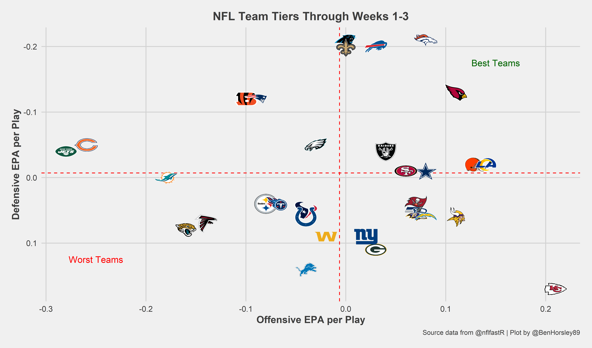

Welcome and thanks for visiting ***insidethenumbeRs***. I'm currently completing my PhD within the [**Sports Performance, Recovery, Injury and New Technologies (SPRINT) Research Centre**](https://www.acu.edu.au/research/our-research-institutes/sprint-research-centre) at Australian Catholic University. I've created ***insidethenumbeRs*** as a platform to share content about my own research, sports science, sports analytics and R.

Throughout my studies, especially my PhD, I've developed a passion for working with sports data, particularly taking data in its rawest form and turning it into something that's useful and easily digestible to people (likely my inner nerd coming out). If your experience is anything like mine was, it can be a little intimidating to know how or where to start learning to code in R, therefore the motivation behind ***insidethenumbeRs*** was to have a platform to contribute informative and instructional content I've learnt along the way as it relates to performing common analytical tasks in R. ***insidethenumbeRs*** aims to provide a useful resource for students (especially those new to R) and practitioners to learn and further develop the skills necessary to get their data into R and how to manipulate, summarise and visualise their data. Visitors to ***insidethenumbeRs*** will get an inside look into the steps and processes for performing these tasks and more that will facilitate your research and analytics workflow.

There will be some exciting content coming out as this site gets up and running and I look forward to sharing it with you! To stay informed of when new contributions to ***insidethenumbeRs*** drop, be sure to follow me on [**Twitter**](https://twitter.com/BenHorsley89).
