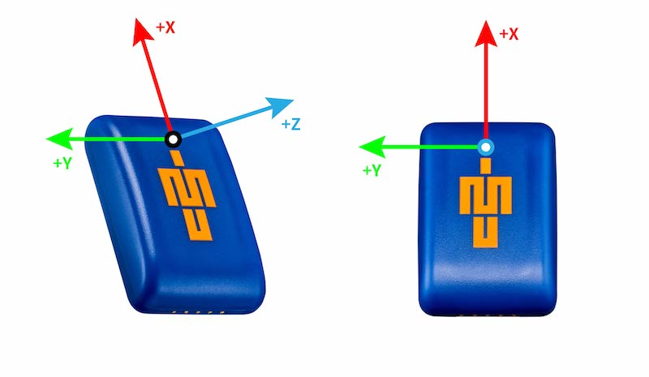
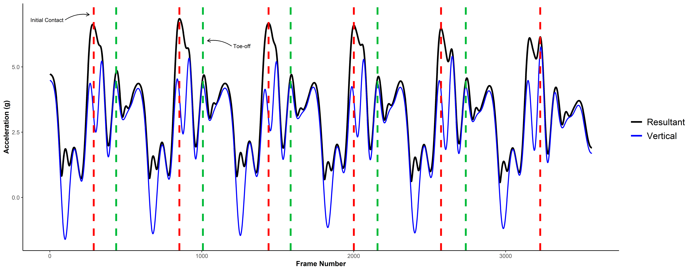
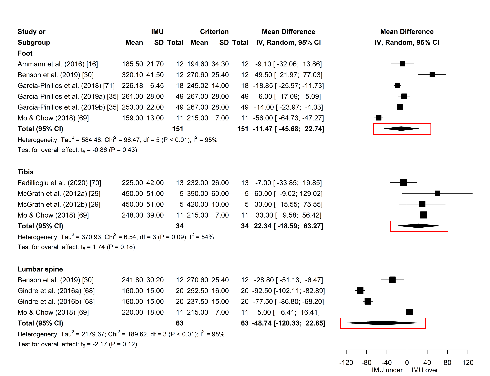
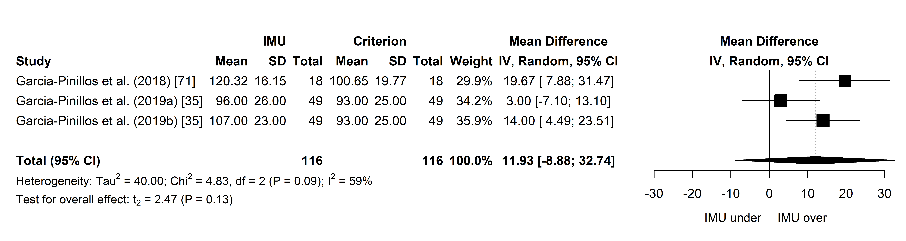
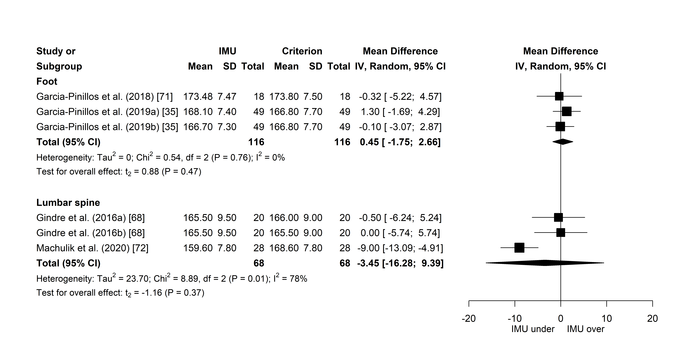
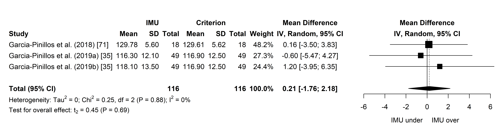

Inertial Measurement Units (IMUs) are becoming an increasingly popular tool for advanced movement pattern detection in sport, including the quantification of running stride variables. This post outlines some considerations as it relates to placement of IMUs for running stride analysis, the results of which come from the first of my PhD studies. 

#### **What are IMUs?**
An IMU is a small wearable device containing an accelerometer, gyroscope and magnetometer. These sensors sample at a high frequency (&#8805; 100 data points captured per second) and measure gravitational acceleration, change in rotational angle and orientation with respect to the Earth's magnetic field in three dimensions (anterior-posterior, vertical and mediolateral). Unlike global positioning systems, IMUs aren't reliant on satellites and can therefore be used indoors, while they can also capture discrete movement patterns to provide extra detail about physical activity beyond typical distance and speed metrics1-3.

{width=50% height=50%}

#### **Why are stride variables important?**
Quantifying stride variables is important to understand ***how*** an athlete runs. Stride data can provide practitioners with useful information about stride patterns that may be used for gait retraining purposes or to inform performance enhancement strategies. Stride variables are also important for understanding the fatigue response during heavy exercise. We know when runners are fatigued their stride pattern changes4,5, resulting in reduced running economy (&#8593; O2 cost at a given speed) and a breakdown of running technique that may impose an increased risk of injury6. Access to stride data may therefore help practitioners develop interventions aimed at mitigating injury risk.

#### **How are stride variables calculated?**
Gait event detection algorithms identify discrete events within the IMU data that correspond to initial contact (foot striking the ground) and toe-off (foot leaving the ground)7,8. These events are often determined from the peaks in the accelerometer or gyroscope signals based on pre-defined criteria set out in the respective algorithm. Once Initial contact and toe-off are known, we can then calculate a variety of spatiotemporal variables, such as contact time, flight time or stride length.

#### **Placement of IMUs**
So, we know we can quantify stride variables from IMUs, but where do we attach them? Well, a variety of attachment sites have been reported in the literature, while some manufacturers of these sensors recommend their own placement methods. What's important, though, is understanding how placement affects the validity of stride variables. Does securing an IMU to the foot provide more accurate stride data than the lower back? The first of my PhD studies examined this very question!

{width=30% height=30%}

We meta-analysed 9 studies and four stride variables (contact time, flight time, step frequency and step length) to determine whether different placement sites impact stride variable validity by assessing the absolute mean difference (MD) between IMU and reference measures (motion capture, force plate, high-speed camera and photocell systems). The meta-analysis showed the MD for stride variables derived from IMUs worn on the foot, tibia and lower back were not significantly different to those determined by the reference systems across all stride variables analysed9. This is depicted in the below forest plots where the width of the diamond (representing the 95% confidence interval of the total effect) for each site overlaps positive and negative MD values.

So, what does this mean? Well, **we can use the foot, tibia or lower back for placement knowing we can derive valid stride data from either site**, supporting the use of IMUs to analyse stride patterns in the field. Practitioners aren't limited to using a single site and instead may use different placements depending on the suitability for the specific sport. We can also conclude that validity appears more dependent on the gait event detection approach, or the mathematics behind it, rather than the location of the IMU.

If you would like to know more about the impact of placement, you can check out the full text of our paper [**here**](https://www.researchgate.net/publication/350357041_Does_Site_Matter_Impact_of_Inertial_Measurement_Unit_Placement_on_the_Validity_and_Reliability_of_Stride_Variables_During_Running_A_Systematic_Review_and_Meta-analysis). You may also contact me should you have any questions about our work or using IMUs for quantifying stride variables in your own environment. Stay tuned for a follow-up post to this where I'll show you how I performed a meta-analysis in R and produced the above forest plots for publication using the `meta` package.

1.&nbsp;&nbsp;Cormack SJ, Mooney MG, Morgan W, McGuigan MR. Influence of neuromuscular fatigue on accelerometer load in elite Australian football players. International Journal of Sports Physiology and Performance. 2013;8(4):373-8. 
2.&nbsp;&nbsp;Glassbrook DJ, Fuller JT, Alderson JA, Doyle TL. Measurement of lower-limb asymmetry in professional rugby league: a technical note describing the use of inertial measurement units. PeerJ. 2020;8:e9366. doi: 10.7717/peerj.9366. 
3.&nbsp;&nbsp;Armitage M, Beato M, McErlain-Naylor SA. Inter-unit reliability of IMU Step metrics using IMeasureU Blue Trident inertial measurement units for running-based team sport tasks. Journal of Sports Sciences. 2021. doi: 10.1080/02640414.2021.1882726. 
4.&nbsp;&nbsp;Morin JB, Jeannin T, Chevallier B, Belli A. Spring-mass model characteristics during sprint running: correlation with performance and fatigue-induced changes. International Journal of Sports Medicine. 2006;27(2):158-65. 
5.&nbsp;&nbsp;Girard O, Micallef J-P, Millet GP. Changes in spring-mass model characteristics during repeated running sprints. European Journal of Applied Physiology. 2011;111(1):125-34. 
6.&nbsp;&nbsp;McMahon TA, Valiant G, Frederick EC. Groucho running. Journal of Applied Physiology. 1987;62(6):2326-37. 
7.&nbsp;&nbsp;Benson LC, Clermont CA, Watari R, Exley T, Ferber R. Automated accelerometer-based gait event detection during multiple running conditions. Sensors. 2019;19(7):1483. doi: 10.3390/s19071483. 
8.&nbsp;&nbsp;Aubol KG, Milner CE. Foot contact identification using a single triaxial accelerometer during running. Journal of Biomechanics. 2020;105:109768. doi: 10.1016/j.jbiomech.2020.109768. 
9.&nbsp;&nbsp;Horsley BJ, Tofari PJ, Halson SL, Kemp JG, Dickson J, Maniar N, et al. Does site matter? Impact of Inertial Measurement Unit placement on the validity and reliability of stride variables during running: a systematic review and meta-analysis. Sports Medicine. 2021. doi: 10.1007/s40279-021-01443-8.