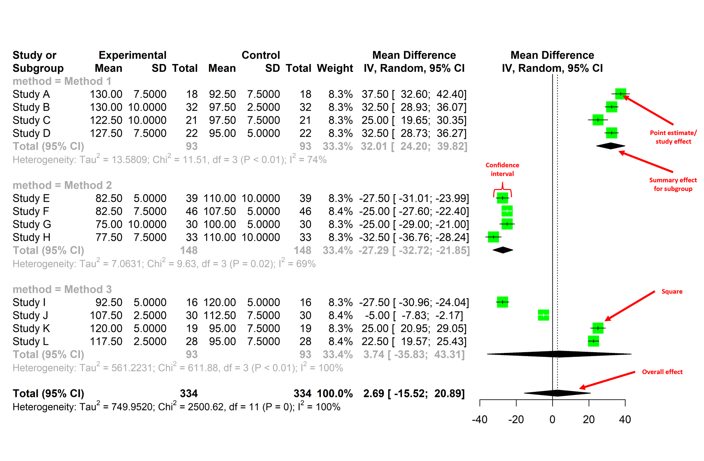
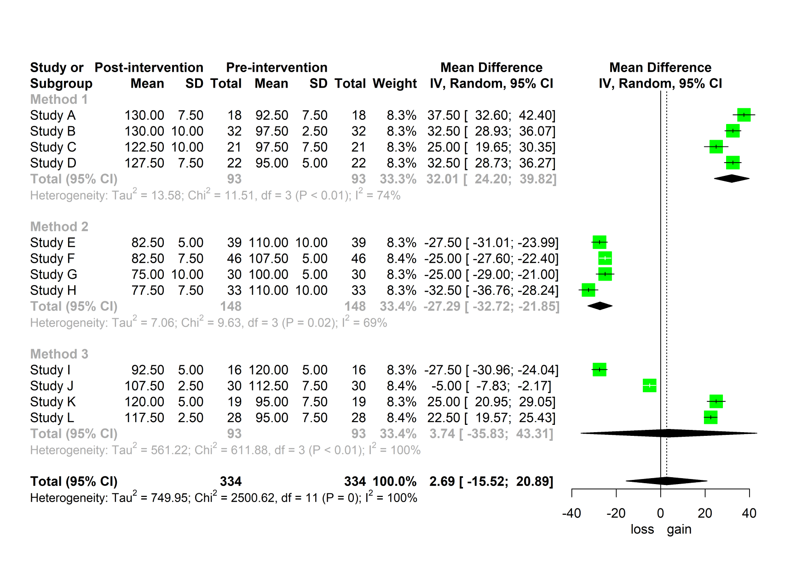
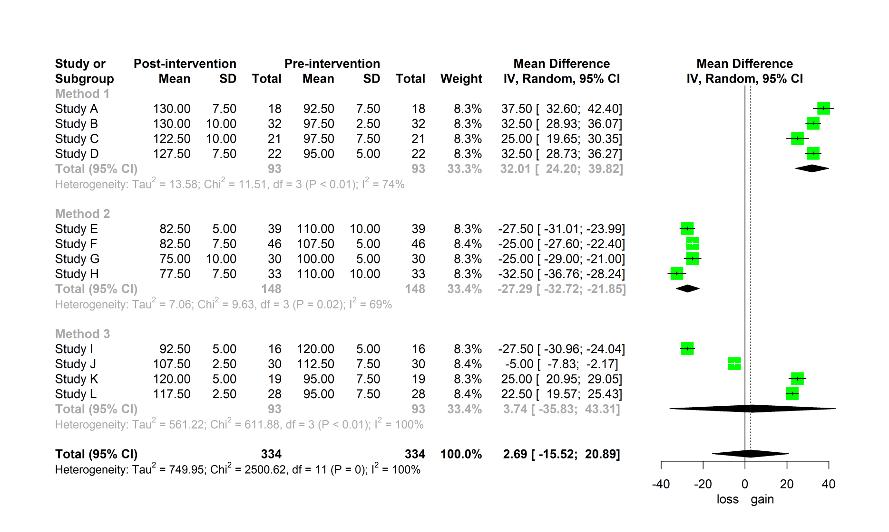
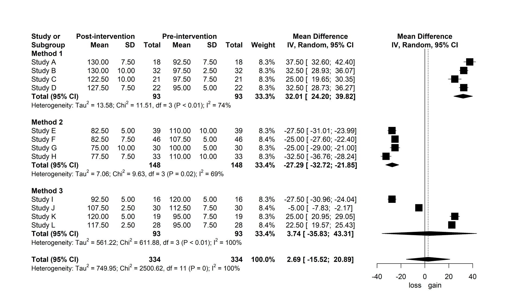
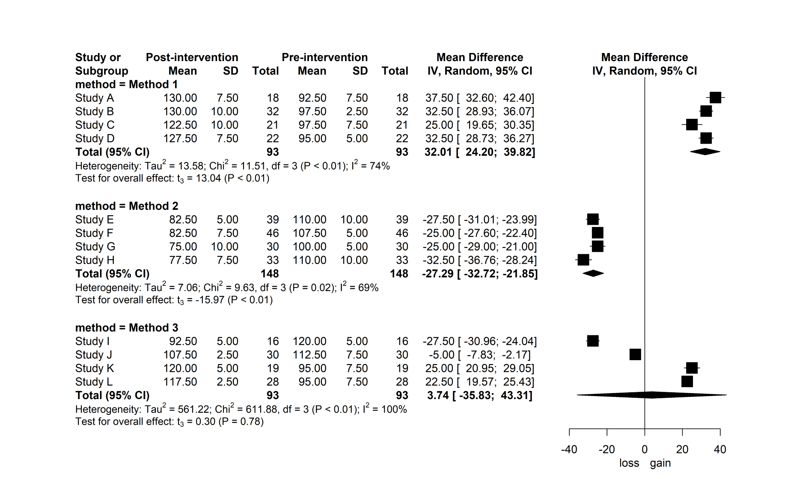

<div align="justify">

My last post outlined the results from a meta-analysis investigating the impact of Inertial Measurement Unit placement on stride variable validity, which you can check out [**here**](https://insidethenumbers.netlify.app/post/imu-placement/). This is a follow-up post that walks you through the steps to performing your own meta-analysis in R and creating publication-quality forest plots. Let's get started!

We'll be using the `meta` package<sup>1</sup> to perform the meta-analysis and generate a forest plot, where much of the content described below draws upon [**Doing Meta-Analysis in R: A Hands-on Guide**](https://bookdown.org/MathiasHarrer/Doing_Meta_Analysis_in_R/) by Mathias Harrer, Pim Cuijpers, Toshi Furukawa and David Ebert.

First, load in the packages we'll be using with `library()`. If you haven't installed any of these packages yet, run `install.packages()` and quote the package name inside the parentheses. I've commented this out using `#` as I already have `meta` installed. You only need to install a package once.

```{r error=FALSE, message=FALSE, warning=FALSE}
# install.packages("tidyverse")
# install.packages("meta")

library(tidyverse)
library(meta)
library(plyr)
```

We're going to need some data to work with. For the purposes of this brief tutorial, I'm going to create some mock data from scratch and pretend to investigate the ***absolute mean difference in lower body strength before and after a training intervention***. We'll pool pretend studies that measured lower body strength via one-repetition maximum on the back squat exercise. You may also import your own data using `read.csv()`.

```{r}
set.seed(10)
study <- paste("Study", LETTERS[1:12])
post_mean <- round_any(c(rnorm(n = 4, mean = 130, sd = 5),
                         rnorm(n = 4, mean = 80, sd = 5),
                         rnorm(n = 4, mean = 110, sd = 10)), 2.5)
post_sd <- round_any(rnorm(n = length(study), mean = 7.5, sd = 2.5), 2.5)
pre_mean <- round_any(c(rnorm(n = 4, mean = 100, sd = 5),
                        rnorm(n = 4, mean = 110, sd = 5),
                        rnorm(n = 4, mean = 110, sd = 10)), 2.5)
pre_sd <- round_any(rnorm(n = length(study), mean = 7.5, sd = 2.5), 2.5)
post_n <- round(rnorm(n = length(study), mean = 25, sd = 10))
pre_n <- post_n
method <- rep(c("Method 1", "Method 2", "Method 3"), each = 4)

dat <- data.frame(study, post_mean, post_sd, pre_mean, pre_sd, post_n,
                  pre_n, method)
```

`set.seed()` takes any integer (whole number) and allows you to generate the same sequence of random numbers. For example, if you were to copy and paste the above code into your own R script with `set.seed(10)`, you'll be able to generate the exact same data as here. Next, I've created eight variables to simulate our data and added these to `data.frame()` assigned (`<-`) to `dat`.<br>

- `study`&nbsp;&nbsp;Study labels. I've used `paste()` to add `"Study"` and the first 12 letters of the alphabet (`LETTERS[1:12]`) together.<br>
- `post_mean`&nbsp;&nbsp;Mean values for our post-intervention strength scores generated from a normal distribution (`rnorm`). I've combined (`c()`) three `rnorm` functions to simulate varying levels of strength data across our 12 studies. For each `rnorm` function, we specify a sample size (`n`), `mean()` and `sd()`. I've also wrapped all of this in `round_any()` from the `plyr` package to round our values to the nearest 2.5 as we don't often see values like 103.6 kg in the strong room!<br>
- `post_sd`&nbsp;&nbsp;Standard deviation of the post-intervention strength scores.<br>
- `pre_mean`&nbsp;&nbsp;Mean of the pre-intervention strength scores (what we're comparing to).<br>
- `pre_sd`&nbsp;&nbsp;Standard deviation of the pre-intervention strength scores.<br>
- `post_n`/`pre_n`&nbsp;&nbsp;Number of observations (participants) per study.<br>
- `method`&nbsp;&nbsp;I'm going to show you how to include subgroups in a meta-analysis, so I've created `method` to simulate different training interventions used across our studies. `rep()` replicates each method four times (`each = 4`).<br>

We can view the first six rows of our data by using pipe (`%>%`) and `head()`from the `dplyr` package (part of the `tidyverse` suite of packages).

```{r}
dat %>% head()
```

#### Meta-analysis
Now that we have our data, let's go ahead and run the meta-analysis. To do this, we're going to call the `metacont()` function in the `meta` package we loaded in earlier. Here's the code.

```{r}
ma <- metacont(post_n,
               post_mean,
               post_sd,
               pre_n,
               pre_mean,
               pre_sd,
               studlab = study,
               data = dat,
               sm = "MD",
               comb.fixed = FALSE,
               comb.random = TRUE,
               hakn = TRUE,
               method.tau = "DL",
               byvar = method)
```

Let's break it down for context.

- `post_n`/`post_mean`/`post_sd`&nbsp;&nbsp;Number of observations, mean and standard deviation for our post-intervention (this could also be an experimental group).<br>
- `pre_n`/`pre_mean`/`pre_sd`&nbsp;&nbsp;Number of observations, mean and standard deviation for our pre-intervention (this could also be a control group).<br>
- `studlab`&nbsp;&nbsp;Study labels in our `study` variable.<br>
- `data`&nbsp;&nbsp;Data set containing the post- and pre-intervention aggregates. We're using `dat` which was created earlier.<br>
- `sm`&nbsp;&nbsp;This is our summary measure for the meta-analysis. We're calculating the absolute mean difference in this example, so we set our summary measure to `"MD"`.<br>
- `comb.fixed = FALSE`/`comb.random = TRUE`&nbsp;&nbsp;We're assuming that the studies we're meta-analysing vary in some way, such as differences in the type of training intervention used. We're therefore choosing a random-effects model (`comb.random`) over fixed-effects (`comb.fixed`) for our meta-analysis as this allows us to account for between-study heterogeneity<sup>2</sup>.<br>
- `hakn`&nbsp;&nbsp;Applying a Knapp-Hartung adjustment to our random-effects model.<br>
- `method.tau`&nbsp;&nbsp;This is the method for calculating tau-squared which is the variance in the distribution of true effect sizes. We're choosing the DerSimonian-Laird (`"DL"`) method which is frequently used in meta-analyses.<br>
- `byvar`&nbsp;&nbsp;Grouping results by `method` (training intervention).<br>

Let's now have a look at the output.

```{r}
ma
```

The first thing you see in the `ma` output is all the studies listed with their individual mean differences (&#177; 95% confidence interval [CI]). These are represented in the units of measurement (kg). We then have our overall mean difference across all studies/subgroups for our random effects model below. Here, we have an effect of 2.69 kg (-15.52, 20.89), suggesting that lower body strength, as measured by a one-repetition maximum on the back squat, improves (marginally) following a training intervention. Makes sense! However, as the 95% CI overlaps positive and negative mean differences, this result is not significantly different (*p* = 0.75) to pre-intervention levels, so we can't categorically conclude lower body strength improves in our total sample of studies. We also have our between-study heterogeneity information listed, and of particular note is *I*<sup>2</sup>. Statistical heterogeneity is considered high when *I*<sup>2</sup> > 50%<sup>3</sup>, and we have a value of 99.6% suggesting considerable between-study heterogeneity. In these instances, further analysis may be worthwhile to determine studies that contribute most to heterogeneity and have a high influence on the overall result, such as leave-one-out-analysis<sup>4</sup>. Finally, we have our subgroup results for each method, and this is where things get a little more interesting! It appears *Method 1* results in a substantial improvement in lower body strength (&#8593; 32 kg) which is significant, whereas *Method 2* leads to a significant strength decrement (&#8595; 27 kg; must have been a bad training intervention). Although there are no *p*-values for each subgroup here, we know the results for these interventions are significant by looking at the 95% CI (no overlap), and this will become clearer in our forest plots. *Method 3* is less clear, though, given we have the 95% CI crossing 0. Differences between training interventions (subgroups) was also significant (*p* < 0.0001; under *Test for subgroup differences*), so we may conclude that if you want to improve your lower body strength, train using *Method 1* and not *Method 2*!

#### Forest plot
We have ran our meta-analysis and interpreted the output, but now we want to visualise our results for publication. We can create forest plots using the `forest()` function to do this. Here's a basic example using our meta-analysis object (`ma`).

```{r eval=FALSE}
forest(ma,
       layout = "RevMan5")
```


By only specifying `ma` and `layout` (Cochrane's Review Manager 5), we get the above forest plot. You can see that our pretend studies and raw outcome data are divided into subgroups based on the intervention. Each study is represented by a point estimate, bounded by the 95% CI for the effect<sup>5</sup>. The square surrounding the point estimate relates to how much studies contribute to the summary effect, where larger squares contribute more (not shown too well in this mock example)<sup>5</sup>. The summary effect for each subgroup and overall is visualised as the diamond at the bottom of the plot<sup>5</sup>. This plot doesn't look too appealing as it currently stands, so let's work through some additional arguments to turn it into something more publishable. We'll start by adding/modifying some labels and changing the number of decimals for the standard deviation and tau-squared to match those reported elsewhere on the plot.

```{r eval=FALSE}
forest(ma,
       layout = "RevMan5",
       ### CHANGE IS HERE ###
       print.byvar = FALSE,
       lab.e = "Post-intervention",
       lab.c = "Pre-intervention",
       label.left = "loss",
       label.right = "gain",
       digits.sd = 2,
       digits.tau2 = 2)
```


`print.byvar = FALSE` removes the "*method =*" from the subgroup labels, while we've changed the labels of our experimental and control groups to **Post-intervention** and **Pre-intervention**. `label.left = "loss"` and `label.right = "gain"` specifies a strength loss and gain following the training intervention on the plot's *x*-axis. The spacing of columns and plot area looks a little tight for my liking, so let's next adjust these to make for easier reading.

```{r eval=FALSE}
forest(ma,
       layout = "RevMan5",
       print.byvar = FALSE,
       lab.e = "Post-intervention",
       lab.c = "Pre-intervention",
       label.left = "loss",
       label.right = "gain",
       digits.sd = 2,
       digits.tau2 = 2,
       ### CHANGE IS HERE ###
       colgap = "0.5cm",
       colgap.forest = "1cm")
```


`colgap` and `colgap.forest` refer to the space between columns and those adjacent to the forest plot (in our case on the left). I think this reads easier now! Given some journals may not accept colour in certain plots, let's next modify the colour of ours.

```{r eval=FALSE}
forest(ma,
       layout = "RevMan5",
       print.byvar = FALSE,
       lab.e = "Post-intervention",
       lab.c = "Pre-intervention",
       label.left = "loss",
       label.right = "gain",
       digits.sd = 2,
       digits.tau2 = 2,
       colgap = "0.5cm",
       colgap.forest = "1cm",
       ### CHANGE IS HERE ###
       col.by = "black",
       col.square = "black",
       col.inside = "black",
       col.square.lines = "black")
```


Our subgroup information (`col.by`) and squares (`col.square`/`col.inside`/`col.square.lines`) are now black and this forest plot is nearing completion. To finish, I'm going to make a couple of statistical changes that are purely personal preference. I'm going to remove the overall summary measure and heterogeneity information (last two lines in the plot) and instead only report these for each subgroup.

```{r eval=FALSE}
forest(ma,
       layout = "RevMan5",
       lab.e = "Post-intervention",
       lab.c = "Pre-intervention",
       label.left = "loss",
       label.right = "gain",
       digits.sd = 2,
       digits.tau2 = 2,
       colgap = "0.5cm",
       colgap.forest = "1cm",
       col.by = "black",
       col.square = "black",
       col.inside = "black",
       col.square.lines = "black",
       ### CHANGE IS HERE ###
       test.effect.subgroup.random = TRUE,
       overall = FALSE,
       overall.hetstat = FALSE)
```


We no longer have an additional diamond at the bottom of our forest plot representing the overall mean difference across all groups and we now have our significant results for *Method 1* (*p* < 0.01) and *Method 2* (*p* < 0.01) confirmed. All we need now is to save our plot as a high-resolution image and we're set. We can do this with the following code.

```{r eval=FALSE}
png(filename = "forest.png", width = 30, height = 18, units = "cm",
    res = 500)

forest(ma,
       layout = "RevMan5",
       lab.e = "Post-intervention",
       lab.c = "Pre-intervention",
       label.left = "loss",
       label.right = "gain",
       digits.sd = 2,
       digits.tau2 = 2,
       colgap = "0.5cm",
       colgap.forest = "1cm",
       col.by = "black",
       col.square = "black",
       col.inside = "black",
       col.square.lines = "black",
       test.effect.subgroup.random = TRUE,
       overall = FALSE,
       overall.hetstat = FALSE)

dev.off()
```

Keep in mind that you'll need to play around with `width` and `height` depending on the size of your own forest plot.

So there we have it. We've taken a mock data set, meta-analysed it, determined *Method 1* is the best training intervention for improving lower body strength and created a forest plot to visualise our results - all in R! The customisations to these plots don't stop here, though. There are many more arguments you can input into `forest` to further customise your plots just the way you like it. The example we've gone through here formed the basis of the forest plots I created for publication in *Sports Medicine*, and I hope these steps can provide a template for you creating your own. I recommend checking out [**Doing Meta-Analysis in R: A Hands-on Guide**](https://bookdown.org/MathiasHarrer/Doing_Meta_Analysis_in_R/) for a more detailed overview.

<div align="left">
<font size="-1">1.&nbsp;&nbsp;Schwarzer G. meta: an R package for meta-analysis. R News. 2007;7(3):40-5.<br>
2.&nbsp;&nbsp;Hedges LV, Vevea JL. Fixed-and random-effects models in meta-analysis. Psychological Methods. 1998;3(4):486-504.<br>
3.&nbsp;&nbsp;Higgins JP, Thompson SG, Deeks JJ, Altman DG. Measuring inconsistency in meta-analyses. British Medical Journal. 2003;327(7414):557-60.<br>
4.&nbsp;&nbsp;Viechtbauer W, Cheung MWL. Outlier and influence diagnostics for meta-analysis. Research Synthesis Methods. 2010;1(2):112-25.<br>
5.&nbsp;&nbsp;Lewis S, Clarke M. Forest plots: trying to see the wood and the trees. British Medical Journal. 2001;322(7300):1479-80.
