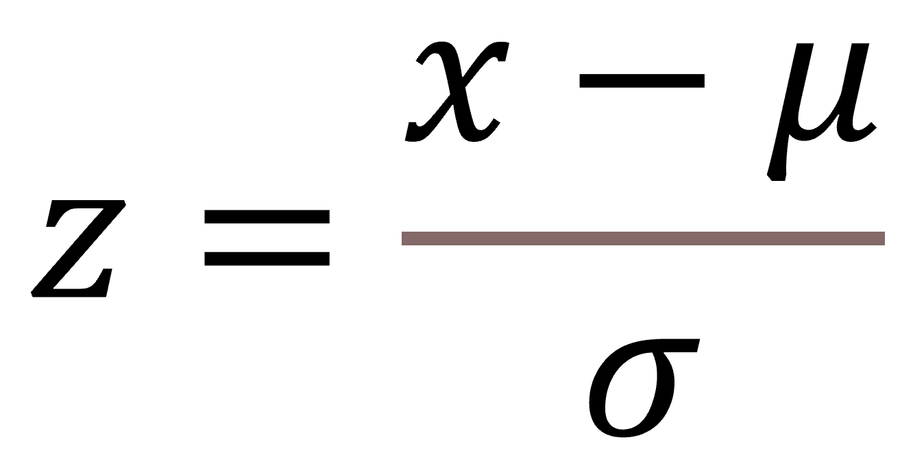

<div align="justify">

This is the second installment of my ***visualising athlete data in R*** series covering a couple of different methods to plot test battery data. Its common for performance staff to have their athletes undergo a series of tests to assess different physical capacities important to their sport. This can help to identify the athlete's strengths and areas that may require further development. For team-sports, it may also be useful to determine how individual athletes compare to their peers in a variety of tests, and one method to do this is by calculating STEN scores.

Test battery data is often collected in a variety of units, so its important to scale the results for more effective plotting. The steps below show how you can scale your athlete test battery data to reflect STEN scores and visualise them using circular and horizontal bar plots to allow for easy comparison across your athlete cohort.

Here are the packages for this tutorial. I'm loading `plyr` before `tidyverse` to avoid any conflicts with `dplyr`.

```{r error=FALSE, message=FALSE, warning=FALSE}
library(plyr)
library(tidyverse)
library(RColorBrewer)
```

Like some of my other posts, I'm again creating a mock dataset using a random number generator (`rnorm`) that represents scores from an example test battery for 15 athletes. The tests include countermovement jump (`cmj_cm`), reactive agility (`rat_s`), 10 (`ten_s`) and 40 m (`forty_s`) sprints, Nordic hamstring (`nordic_n`), isometric mid-thigh pull (`imtp_n.kg`), bench press (`bench_kg`) and Yo-Yo Intermittent Recovery Test Level 1 (`yoyo`). `head()` shows the first six rows of the data so you can see what it looks like.

```{r}
set.seed(50)
test_dat <- data.frame(
  
  athlete = paste("Athlete", 1:15),
  cmj_cm = round(rnorm(15, mean = 30, sd = 5), 1),
  rat_s = round(rnorm(15, mean = 2.3, sd = 0.4), 1),
  ten_s =  round(rnorm(15, mean = 2, sd = 0.3), 1),
  forty_s = round(rnorm(15, mean = 5.4, sd = 0.3), 1),
  nordic_n = round(rnorm(15, mean = 400, sd = 30), 1),
  imtp_n.kg = round(rnorm(15, mean = 33, sd = 4), 1),
  bench_kg = round_any(rnorm(15, mean = 90, sd = 5), 2.5),
  yoyo = round(rnorm(15, mean = 18, sd = 1), 1)
  
)

test_dat %>% head()
```

This test battery data is in a raw format, but we need to convert these values to a z-score to then input into the STEN score calculation. A z-score is calculated as:

{width=20% height=20%}

where *x* is the athlete's raw score, *&#956;* is the mean of the squad and *&#963;* is the standard deviation of the squad. A z-score provides an indication of how far a particular data point is from the mean, where a z-score of 0 represents the raw score being identical to the mean. Applying the `scale()` function to the data calculates z-scores really easily. I'm using `mutate_if()` to apply `scale()` to only numeric columns.

```{r}
z <- test_dat %>%
  mutate_if(is.numeric, scale) %>%
    mutate(across(where(is.numeric), round, 2))

z %>% head()
```
We can now see how many standard deviations from the mean each athlete's set of test scores are. The next step is to convert these z-scores to a STEN (Standard Tens) score - a score out of 10. Here's how its calculated:

{width=30% height=30%}

where *z* is the athlete's z-score. A STEN score of <2 may be considered well below average, 5-7 average and >9 above average compared to the group. Given a 0-10 scale resonates for most people (closer to 10 being better), this may be a useful method for reporting athlete test data to coaches. `mutate()` coupled with `across()` applies the STEN calculation to each value (`.`) in all columns besides `athlete`. The second `mutate()` function reverses the scale for reactive agility, 10 and 40 m sprint tests given lower values reflect superior performance.

```{r}
sten <- z %>%
  mutate(across(c(2:9), ~ . * 2 + 5.5)) %>%
  mutate(rat_s = 10 - rat_s,
         ten_s = 10 - ten_s,
         forty_s = 10 - forty_s) %>%
  mutate(across(where(is.numeric), round, 1))

sten %>% head()
```
Before I start plotting, I'm converting the data from wide format to long with `pivot_longer()` as we want to plot all tests as the `x` aesthetic in `ggplot2`. This will arrange the data so each measure is a sub entry under the column `test`. I'm also recoding the text strings for `test` so the names of each test are more presentable in a plot (this step is totally preferential depending on your level of OCD!).

```{r}
sten_long <- sten %>%
  pivot_longer(!athlete, names_to = "test", values_to = "sten_score") %>%
  mutate(test = case_when(test == "cmj_cm" ~ "CMJ (cm)",
                          test == "rat_s" ~ "RAT (s)",
                          test == "ten_s" ~ "10 m Sprint (s)",
                          test == "forty_s" ~ "40 m Sprint (s)",
                          test == "nordic_n" ~ "Nordic (N)",
                          test == "imtp_n.kg" ~ "IMTP (N/kg)",
                          test == "bench_kg" ~ "Bench Press (kg)",
                          test == "yoyo" ~ "Yo-Yo IR1",
                          TRUE ~ as.character(test)))

sten_long %>% head(8)
```

### Plotting

The data is now ready to plot! First, I'm going to create a circular bar plot that may be used as an alternative to a spider or radar chart. Next, I'll show how we can easily make a horizontal bar plot to rank an athlete's test outcomes.

###### Circular bar plot

I'm leaning on the work by [**Tobias Stalder**](https://tobias-stalder.netlify.app/) to illustrate this circular bar plot example. Before I start compiling the plot, I'm creating a couple of variables to use as arguments in `ggplot()`. The first is a string to filter on a specific athlete (`ath`), while the second determines which test out of the eight listed has the lowest STEN score (`sten_low`). I'm simply using `sten_low` to inform where to include the scale labels inside the plot.

```{r}
ath <- "Athlete 5"
sten_low <- sten_long %>%
  filter(athlete == ath) %>%
  filter(sten_score == min(sten_score))
```

Let's run these first few lines of code. Here, I'm filtering `sten_long` based on the athlete we assigned to `ath` above, while the `geom_hline()` function - neatly explained by [**Tobias Stalder**](https://tobias-stalder.netlify.app/) - creates custom grid lines at intervals of 2 (the reason for this step will be demonstrated further down). The bars are created with `geom_col()` which includes the use of `str_wrap()` to the `x` argument to wrap the test names over multiple lines. `str_wrap(test, 7)` seemed to format the current test labels the best. The lower limit (`-3`) in `scale_y_continuous()` expands the inner circle of the plot, while a custom fill is applied with `scale_fill_stepsn()`. For the fill, I'm using the `YlGn` palette from `RColorBrewer` to fill the bars based on the STEN score, with lower values represented by a lighter colour and higher values darker. `coord_polar` gives the circular appearance to the plot.

```{r}
ggplot(sten_long %>% filter(athlete == ath)) +
  geom_hline(aes(yintercept = y), data.frame(y = c(0, 2, 4, 6, 8, 10)),
                 colour = "lightgrey") +
  geom_col(aes(x = str_wrap(test, 7), y = sten_score, fill = sten_score),
           alpha = 0.7, show.legend = TRUE) +
  scale_y_continuous(limits = c(-3, 11), breaks = seq(0, 10, 2)) +
  scale_fill_stepsn("STEN Score", colours = brewer.pal(name = "YlGn", n = 5),
                    limits = c(0, 10), breaks = 0:5 * 2) +
  geom_segment(aes(x = str_wrap(test, 7), y = 0, xend = str_wrap(test, 7),
                   yend = 11), linetype = "dashed", colour = "darkgrey") +
  coord_polar() +
  theme_minimal()
```

Next, I'm using five `geom_text()` arguments to insert custom scale labels inside the plot. Where possible, I want labels in as much white space as possible to aid readability, therefore I'm calling `data = sten_low` - created above - to tell `geom_text()` to position the labels over the lowest STEN score/bar. By using `is.numeric(test) + 3.7`, the labels are positioned slightly to the right of the segment line. You may need to play around with your own value depending on how many tests you have in your plot.

```{r}
ggplot(sten_long %>% filter(athlete == ath)) +
  geom_hline(aes(yintercept = y), data.frame(y = c(0, 2, 4, 6, 8, 10)),
                 colour = "lightgrey") +
  geom_col(aes(x = str_wrap(test, 7), y = sten_score, fill = sten_score),
           alpha = 0.7, show.legend = TRUE) +
  scale_y_continuous(limits = c(-3, 11), breaks = seq(0, 10, 2)) +
  scale_fill_stepsn("STEN Score", colours = brewer.pal(name = "YlGn", n = 5),
                    limits = c(0, 10), breaks = 0:5 * 2) +
  geom_segment(aes(x = str_wrap(test, 7), y = 0, xend = str_wrap(test, 7),
                   yend = 11), linetype = "dashed", colour = "darkgrey") +
  coord_polar() +
  theme_minimal() +
  ### CHANGE IS HERE ###
  geom_text(data = sten_low, aes(x = is.numeric(test) + 3.7, y = 2.5),
            label = "2", size = 2.5) +
  geom_text(data = sten_low, aes(x = is.numeric(test) + 3.7, y = 4.5),
            label = "4", size = 2.5) +
  geom_text(data = sten_low, aes(x = is.numeric(test) + 3.7, y = 6.5),
            label = "6", size = 2.5) +
  geom_text(data = sten_low, aes(x = is.numeric(test) + 3.7, y = 8.5),
            label = "8", size = 2.5) +
  geom_text(data = sten_low, aes(x = is.numeric(test) + 3.7, y = 10.5),
            label = "10", size = 2.5)
```

To finish the plot off, I'm editing the legend so its orientated horizontally and positioned above the chart. There's also some theme edits to finalise the formatting of the plot, including `panel.grid = element_blank()` which removes the plot's default grid lines so we're left with our custom grid created with `geom_hline`. You'll see that the test labels now appear to be sitting above the plot which looks a lot better!

```{r}
ggplot(sten_long %>% filter(athlete == ath)) +
  geom_hline(aes(yintercept = y), data.frame(y = c(0, 2, 4, 6, 8, 10)),
                 colour = "lightgrey") +
  geom_col(aes(x = str_wrap(test, 7), y = sten_score, fill = sten_score),
           alpha = 0.7, show.legend = TRUE) +
  scale_y_continuous(limits = c(-3, 11), breaks = seq(0, 10, 2)) +
  scale_fill_stepsn("STEN Score", colours = brewer.pal(name = "YlGn", n = 5),
                    limits = c(0, 10), breaks = 0:5 * 2) +
  geom_segment(aes(x = str_wrap(test, 7), y = 0, xend = str_wrap(test, 7),
                   yend = 11), linetype = "dashed", colour = "darkgrey") +
  coord_polar() +
  theme_minimal() +
  geom_text(data = sten_low, aes(x = is.numeric(test) + 3.7, y = 2.5),
            label = "2", size = 2.5) +
  geom_text(data = sten_low, aes(x = is.numeric(test) + 3.7, y = 4.5),
            label = "4", size = 2.5) +
  geom_text(data = sten_low, aes(x = is.numeric(test) + 3.7, y = 6.5),
            label = "6", size = 2.5) +
  geom_text(data = sten_low, aes(x = is.numeric(test) + 3.7, y = 8.5),
            label = "8", size = 2.5) +
  geom_text(data = sten_low, aes(x = is.numeric(test) + 3.7, y = 10.5),
            label = "10", size = 2.5) +
  ### CHANGE IS HERE ###
  guides(fill = guide_colorsteps(barheight = 0.3, barwidth = 10,
                                 title.position = "top", title.hjust = 0.5)) +
  theme(panel.grid = element_blank(),
        axis.title = element_blank(),
        axis.text.x = element_text(face = "bold", size = 8),
        axis.text.y = element_blank(),
        legend.position = "top",
        legend.title = element_text(size = 6),
        legend.text = element_text(size = 6))
```

Now our circular bar plot is complete! We can see that this athlete has scored well below average, compared to the group, in the countermovement jump, but displays improved lower body strength with a higher ranking for the isometric mid-thigh pull (this is a pretend dataset, of course). Circular bar plots are a great alternative to perhaps the more familiar spider/radar chart. However, we can also very easily create a similar plot by flipping the bars horizontally.

###### Horizontal bar plot

Much of the code for the horizontal bar plot is similar to that for the circular bar chart, so the steps involved here aren't broken up like the example above. I'm plotting a different athlete's data here and using `fct_reorder()` from the `forcats` package (part of the `tidyverse` suite) to order the tests from the highest STEN score to lowest.

```{r}
ath <- "Athlete 14"

ggplot(sten_long %>% filter(athlete == ath)) +
  geom_col(aes(x = fct_reorder(test, sten_score), y = sten_score, fill = sten_score), alpha = 0.7, show.legend = TRUE) +
  scale_y_continuous(limits = c(0, 10), breaks = seq(0, 10, 2)) +
  scale_fill_stepsn("STEN Score", colours = brewer.pal(name = "YlGn", n = 5),
                    limits = c(0, 10), breaks = 0:5 * 2) +
  coord_flip() +
  theme_minimal() +
  ylab("STEN") +
  guides(fill = guide_colorsteps(barheight = 0.3, barwidth = 10,
                                 title.position = "top", title.hjust = 0.5)) +
  theme(panel.grid.minor.x = element_blank(),
        panel.grid.major.y = element_blank(),
        axis.title.y = element_blank(),
        axis.text.y = element_text(face = "bold"),
        legend.position = "top",
        legend.title = element_text(size = 6),
        legend.text = element_text(size = 6))
```

Ordering the bars from highest to lowest makes it really easy to identify which test the particular athlete performed best in relative to their peers, which in this case is the 10 m sprint, reflecting this athlete's high acceleration ability. However, this plot also highlights that this athlete requires further development of their lower body strength, so a few extra sets of squats may be required in the gym!

So, there you have it! We've covered how to calculate z-scores and STEN scores to scale your athlete test battery data and used two simple and effective plotting techniques to visualise an athlete's test rankings. Give these plots a try with your own (and proper) data and hopefully they add some value to your athlete monitoring workflow. There's a lot more content coming out over the coming weeks and months, so make sure to follow me on [**Twitter**](https://twitter.com/BenHorsley89) to stay up to date with new tutorials and posts. Your support is greatly appreciated!
